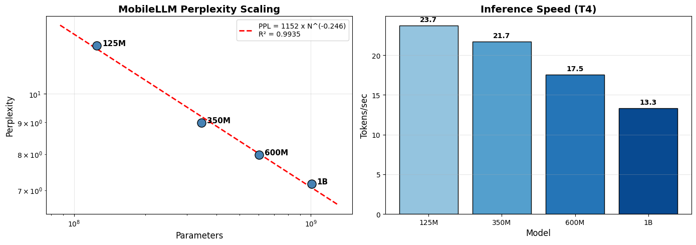

# Scaling Laws for Small Language Models

Research project exploring scaling laws for sub-billion parameter language models, with a focus on Facebook's MobileLLM family.

## Key Finding

```
PPL = 1152 × N^(-0.2457)
R² = 0.9935
```

MobileLLM exhibits a **steeper scaling exponent** (-0.246) compared to general LLM scaling laws (-0.08), suggesting more efficient scaling in the sub-1B regime. Doubling parameters yields ~16% lower perplexity.



## Results Summary

| Model | Parameters | Perplexity | Tokens/sec | Memory |
|-------|------------|------------|------------|--------|
| MobileLLM-125M | 125M | 11.96 | 23.7 | 0.7 GB |
| MobileLLM-350M | 345M | 8.98 | 21.7 | 1.2 GB |
| MobileLLM-600M | 603M | 7.98 | 17.5 | 1.7 GB |
| MobileLLM-1B | 1,005M | 7.17 | 13.3 | 2.6 GB |

**Sweet spot**: The 350M model offers the best quality/parameter ratio — 25% better perplexity than 125M for only 8% speed loss.

See [results/report.md](results/report.md) for full analysis.

## What's This About?

I'm investigating how scaling laws apply to sub-billion parameter models. The big labs have done extensive work on scaling laws for massive models, but there's less research on what happens at the smaller end — where models actually run on devices.

MobileLLM is particularly interesting because of its "deep and thin" architecture philosophy: more layers with smaller hidden dimensions, plus tricks like Grouped Query Attention and SwiGLU.

## Quick Start

**Run the evaluation notebook on Colab:**

[](https://colab.research.google.com/github/ValtricAI/Scaling-Laws-for-Small-Language-Models/blob/main/notebooks/scaling_study_fixed.ipynb)

**Local setup:**
```bash
python3 -m venv .venv
source .venv/bin/activate
pip install -e ".[dev]"
```

You'll need to authenticate with HuggingFace and accept the MobileLLM license:
```bash
huggingface-cli login
```

Then visit https://huggingface.co/facebook/MobileLLM-350M to accept the license.

## Project Structure

```
├── configs/           # Model, training, and experiment configs
├── src/
│   ├── data/          # Data loading and preprocessing
│   ├── models/        # Attention mechanisms and architectures
│   ├── training/      # Trainer, optimizer, scheduler
│   ├── evaluation/    # Benchmarks and metrics
│   └── scaling/       # Scaling law implementations
├── scripts/           # Training and evaluation scripts
├── notebooks/         # Analysis notebooks
├── results/           # Evaluation results and reports
│   ├── report.md      # Full analysis report
│   ├── results.csv    # Raw data
│   └── figures/       # Plots
└── tests/             # Unit tests
```

## MobileLLM Architecture

| Model | Params | Layers | Hidden | Heads | KV Heads |
|-------|--------|--------|--------|-------|----------|
| MobileLLM-125M | 124.6M | 30 | 576 | 9 | 3 |
| MobileLLM-350M | 345.3M | 32 | 960 | 15 | 5 |
| MobileLLM-600M | 603.1M | 40 | 1152 | 18 | 6 |
| MobileLLM-1B | 1.01B | 54 | 1280 | 20 | 5 |

## References

- [MobileLLM Paper](https://arxiv.org/abs/2402.14905) - Optimizing Sub-billion Parameter Language Models for On-Device Use Cases
- [Chinchilla Paper](https://arxiv.org/abs/2203.15556) - Training Compute-Optimal Large Language Models
- [Kaplan et al.](https://arxiv.org/abs/2001.08361) - Scaling Laws for Neural Language Models
